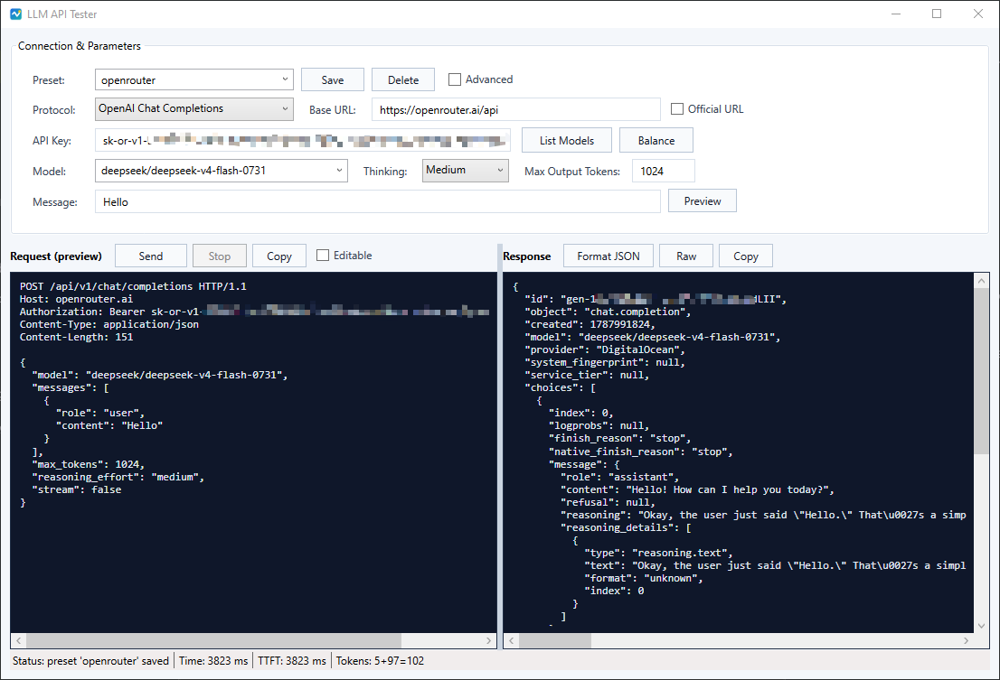

# LLM API Tester 使用说明

一个测试各渠道大模型 API 的GUI小工具（WPF）。

支持 4 种协议：**OpenAI Chat Completions、Claude / Anthropic、Google Gemini、OpenAI Responses (Codex)**。

使用.NET Framework 4.8编译，体积小，Windows10(只要不是太老版本)以上系统都可直接运行无需额外依赖。

---

## 一、运行 / 编译

VS2026_Build.bat为VS2026 的 快捷编译脚本，输出文件为：

```
bin\Release\ApiTester.exe
```
---

## 二、界面总览

- **顶部 “Connection & Parameters”**：连接信息与请求参数。

- **中部**：左 = **Request (preview)** 发送前请求预览，右 = **Response** 响应；中间竖条可拖动调节左右宽度。

- **底部状态栏**：`Status` / `Time` / `TTFT` / `Tokens`。

  

---

## 三、快速上手（5 步）

1. 选 **Protocol**（协议）。
2. 填 **Base URL**（接口根地址）。想让它随协议自动填官方默认地址，就勾右侧 **Official URL**（见下）。
3. 填 **API Key**（明文显示，方便核对/粘贴）。
4. 点 **List Models** 拉取模型 → 在 **Model** 下拉里选一个。
5. 在 **Message** 写内容（默认 `Hello`），点 **Send**。想看流式输出就展开 **Advanced** 后勾 **Stream**。

---

## 四、各控件说明

### 顶部
- **Protocol**：协议。切换会清空 Model 列表；选 Claude 时 **Temperature** 会被禁用（该模型不接受 temperature）。
- **Base URL**：API 根地址，如 `https://api.openai.com`。工具会自动补该协议对应的路径（如 `/v1/chat/completions`）。只要 Base URL 以 `/vN` 结尾（v 后带数字，如 `/v1`、`/v2`、`/v1beta`），就认为版本已包含在 Base URL 中，只追加后面的路径（如 `/chat/completions`），且斜杠不会重复或缺失。
- **Official URL**（勾选框）：
  - **勾选**：切换协议时自动把 Base URL 填成该协议默认地址（勾上的当下也会立即填当前协议默认）。
  - **不勾（默认）**：切换协议**不动** Base URL——方便你填自己的中转/自建/本地地址。
  - 程序启动时**默认不勾**，因此 **Base URL 初始为空**。
  - 各协议默认地址：OpenAI / Responses = `https://api.openai.com`；Claude = `https://api.anthropic.com`；Gemini = `https://generativelanguage.googleapis.com`。
- **API Key**：密钥，**明文显示**。不同协议鉴权方式不同，工具会自动放到正确位置：OpenAI / Responses → `Authorization: Bearer`；Claude → `x-api-key`（+ `anthropic-version`）；Gemini → URL 的 `?key=`（+ `x-goog-api-key` 头）。Preset 会保存 Key。
- **List Models**：用当前 Base URL + Key 拉取模型列表，填进 Model 下拉；列表也会显示在右侧响应框，同时本次发送的 HTTP 请求包会显示到 Request。失败时状态栏/响应框显示错误。
- **Balance**：通过当前 Base URL + Key 请求 `GET /v1/dashboard/billing/subscription`，用于查看 OpenAI 兼容服务的订阅 / 余额相关信息。请求会显示到 Request，响应显示在 Response。
- **Model**：模型 ID，可从下拉选，也可手输。
- **Thinking**：思考等级。选择模型时会自动切换可选等级表并匹配默认值；支持 thinking 的模型默认选择 `Medium`；OpenAI Chat / Responses 会把非 `None` 值作为 reasoning 参数发送，Claude / Gemini 忽略。
  - 普通模型（未匹配到特定列表）：`None` / `Low` / `Medium` / `High` / `Max`
  - `o1` / `o3` / `o4`：`None` / `Low` / `Medium` / `High` / `XHigh`
  - `Opus 4.x` / `Claude Opus`：`None` / `Low` / `Medium` / `High` / `XHigh`
  - `GPT 5.x` / `GPT OSS` / `Codex` / `GLM 5.x` / `Minimax M3` / `reasoning`：`None` / `Minimal` / `Low` / `Medium` / `High` / `XHigh`
- **Max Output Tokens**：最大生成 token 数（默认 1024）。
- **Preset**：连接预设（可编辑下拉）。见第六节。
- **Advanced**：默认折叠；展开后显示低频配置。折叠时如果部分高级配置正在生效，会显示 `Advanced: ...` 摘要。
- **Temperature**：temperature 采样温度（**留空则不发送**）。Claude 协议下禁用。
- **Stream (SSE)**：勾选后走流式，响应实时逐块追加显示，并统计首字耗时 TTFT。
- **List Models Timeout**：List Models 请求超时秒数，默认 5 秒。
- **Send Timeout**：Send 请求超时秒数，默认 30 秒；流式请求也会按该值限制总耗时。
- **Proxy**：请求代理。`None` 为直连；`HTTP` 使用 HTTP/HTTPS 代理；`SOCKS5` 使用内置 SOCKS5 连接层。Host / Port 必填，User / Pass 可留空。
- **System**：system 提示（可留空）。
- **Message**：要发送的用户消息（默认 `Hello`），支持粘贴多行文本；Advanced 展开时显示为多行输入框。其右侧的 **Preview** 按钮点击后立即用当前表单重新生成 Request 预览（在 Editable 模式下也会丢弃手动修改、回到自动生成的结果）。
- **OpenAI Juice**：Advanced 展开后显示；把内置的 OpenAI Juice 测试 XML 填入 Message，再点一次会恢复为 `Hello`。

### 中部
- **Request (preview)**：发送前**实时预览**将要发出的完整 HTTP 请求包（请求行 + Host + 头 + body），Key 会按真实内容显示。
  - **Send** 发送 · **Stop** 取消进行中的请求 · **Copy** 复制预览文本。
  - **Editable**：勾选后可直接修改 Preview 内容；只有手动改过 Preview 后，发送时才会按编辑后的 HTTP 包发送。修改上方配置项会重新生成 Preview。
  - **List Models** / **Balance** 会直接把本次发送的 HTTP 包显示到 Request。
- **Response**：响应内容。
  - **Format JSON**：把响应体美化缩进。
  - **Raw**：显示完整 HTTP 响应包（状态行 + 返回头 + body；流式时 body 为原始 SSE 累积）。
  - **Copy**：复制响应文本。

### 底部状态栏
- **Status**：HTTP 状态码 + 文本（或 `Cancelled` / `ERROR`）。
- **Time**：本次请求总耗时（ms）。
- **TTFT**：流式下首块到达耗时（ms）；非流式等于总耗时。
- **Tokens**：用量，格式 `prompt+completion=total`（缺失项显示 `?`）。

---

## 五、非流式 vs 流式

- **非流式**（不勾 Stream）：一次性拿到完整响应，响应框显示**美化后的 JSON**，Token 从响应里解析。
- **流式**（勾 Stream）：响应框**实时追加**文本，状态栏显示 **TTFT**；点 **Raw** 可看完整 HTTP 响应包，body 为原始 SSE。

---

## 六、预设（Preset）

**预设（Preset）** = 保存一套界面配置，方便下次一键切换。

- **保存**：在 Preset 框输入一个名字，点 **Save**。
- **加载**：在 Preset 下拉里选中某名字 → 自动回填协议、Base URL、API Key、Model、Thinking、timeout、token、temperature、stream、proxy、system 等界面内容；Message、Advanced 展开状态、Editable 状态不会随 Preset 保存或回填。
- **删除**：Preset 框显示某名字时点 **Delete**。
- 切换 Model 时，当前 Preset 会只记住最后选择/输入的模型 ID，不保存完整模型列表。

**保存到哪里**：
```
程序所在目录下，与 EXE 同名的 JSON 文件，例如：
bin\Release\ApiTester.json
```
文件是 JSON，形如：
```json
{
  "LastPresetName": "my-openai",
  "Presets": [
    {
      "Name": "my-openai",
      "Kind": 0,
      "BaseUrl": "https://api.openai.com",
      "ApiKey": "<your-api-key>",
      "Model": "gpt-4.1",
      "ThinkingLevel": "None",
      "ListModelsTimeoutSeconds": "5",
      "SendTimeoutSeconds": "30",
      "ProxyType": "None",
      "ProxyHost": "",
      "ProxyPort": "",
      "ProxyUser": "",
      "ProxyPassword": ""
    }
  ]
}
```

程序会默认加载上次使用的 Preset。

---

## 七、常见提示

- **401 / 403**：Key 无效或权限不足——状态栏显示状态码，响应框显示 API 的错误说明。
- **429**：被限流，稍后再试。
- **连不上 / 超时**：检查 Base URL、网络、是否需要代理。
- **Claude 与 temperature**：本工具对 Claude 协议**不发送 temperature**（Opus 4.7/4.8 会因此 400）。
- **Gemini 模型名带 `models/` 前缀**：工具会自动处理，选/填都可以。

---

## 八、四协议端点速览

| 协议 / 功能 | 列模型 | 对话 / 查询 | 鉴权 |
|---|---|---|---|
| OpenAI Chat | `GET /v1/models` | `POST /v1/chat/completions` | `Authorization: Bearer` |
| Claude | `GET /v1/models` | `POST /v1/messages` | `x-api-key` + `anthropic-version: 2023-06-01` |
| Gemini | `GET /v1beta/models?key=` | `POST /v1beta/models/{model}:generateContent?key=` | `?key=` / `x-goog-api-key` |
| OpenAI Responses | `GET /v1/models` | `POST /v1/responses` | `Authorization: Bearer` |
| Balance | - | `GET /v1/dashboard/billing/subscription` | `Authorization: Bearer` |
